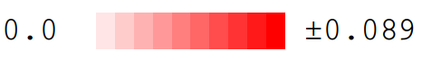

CPRISMA is written by:

Sergio Alejandro Poveda Cuevas
seapovedac@gmail.com
Laboratory of Computational Biophysical Chemistry
University of São Paulo, Ribeirão Preto - SP, Brazil

CPRISMA is free software; you can redistribute it and/or modify it under the terms of the
GNU General Public License, version 3 (GPLv3).

CPRISMA (version 1.0, 2021) is a bioinformatics program that gives color to protein multiple sequence alignments
based on an input of numerical data.

More details can be found in the user’s guide documentation found in the file "docs/CPRISMA user's guide - 2021.pdf".

Some similar examples of the possible outputs obtained with CPRISMA can be found
on the next publications:

* Poveda-Cuevas, S.A.; Etchebest, C.; Barroso da Silva, F. L. Insights into the ZIKV NS1 Virology from
Different Strains through a Fine Analysis of Physicochemical Properties. ACS Omega, 3(11)
pp 16212–16229, 2018 (doi: https://doi.org/10.1021/acsomega.8b02081).

* Poveda-Cuevas, S.A.; Etchebest, C.; Barroso da Silva, F. L. Identification of Electrostatic Epitopes
in Flavivirus by Computer Simulations: The PROCEEDpKa Method. ACS Journal of Chemical Information and Modeling,
60(2) pp 944–963, 2020 (doi: https://doi.org/10.1021/acs.jcim.9b00895).

* Poveda-Cuevas, S.A.; Barroso da Silva, F. L.; Etchebest, C. How the Strain Origin of ZIKV NS1 Protein Impacts its
Dynamics and Implications to their Differential Virulence. ACS Journal of Chemical Information and Modeling,
61(3) pp 1516–1530, 2021, 2021 (doi: https://doi.org/10.1021/acs.jcim.0c01377).

Another sources:

   # Requirements    #

CPRISMA requires Python 3.7 or higher, Numpy, Pandas, and Argparse.

   # Installation    #

CPRISMA can be installed by downloading the source code or cloning the repository executing:

	git clone https://github.com/seapovedac/cprisma.git

Then:

	pip install .

   # Uninstallation    #

 To uninstall CPRISMA you can invoke the next command:

	pip uninstall cprisma

   # Getting started    #

CPRISMA can be executed invoking the command:

	cprisma

or

	python -m cprisma

A list of options can be visualized with the -h option:

	cprisma -h

For the correct execution of the program, three different files should appear in the directory:

	1) a python script called ‘array_get.py’,
	2) the alignment to put the color called ‘alignment.dat’, and
	3) a CSV file called ‘data_input.csv’.

The alignment data is based on outputs of the MUSCLE program in ClustalW format and the data of the CSV
file can be any type of numerical information given in columns.

   # Examples #

CPRISMA can be tested using the files in [examples/].

Some examples of images that can be generated by CPRISMA appear below.

  a) Example 1: ∆p<i>Ka</i> for several NS1ZIKV

	

	

  b) Example 2: B-cell epitope predictions on NS1WNV(176−352)

	

	

  c) Example 3: Protein structural domains for two NS1ZIKV and its biological interfaces

	

   # Additional documentation    #

Additional documentation can be found in the file "docs/CPRISMA user's guide - 2021.pdf".
